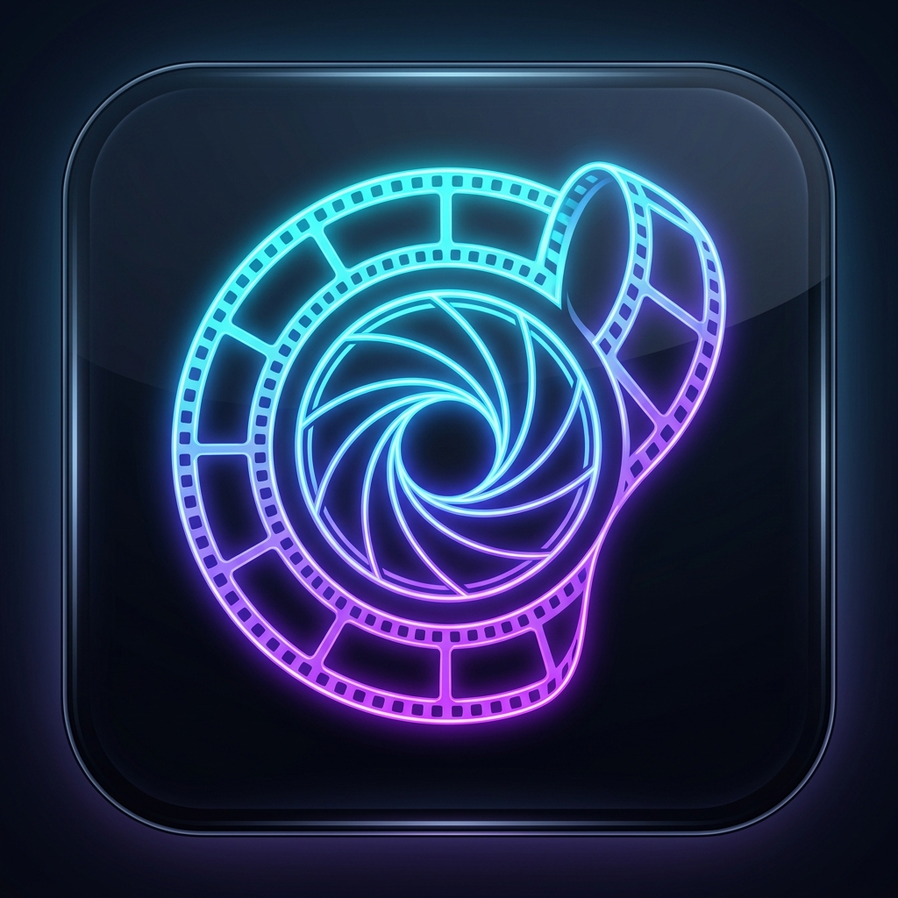

# 🎬 Frame Extractor - Extractor Magistral de Fotogramas e IA Local

<p align="center">
  
</p>

<p align="center">
  <strong>La herramienta definitiva para capturar, analizar con IA, retocar y componer fotogramas de vídeo a máxima resolución.</strong>
</p>

<p align="center">
  <a href="https://github.com/GomSamurai"></a>
  
  
  
</p>

---

## 🌟 Novedades y Funcionalidades Principales

### 🤖 1. Smart IA Vision Engine (Procesamiento 100% Local)
- ✍️ **Buscador de Conceptos por Texto Libre**: Escribe cualquier acción o concepto (*"sonrisa radiante"*, *"mirada a cámara"*, *"beso"*, *"perro / mascota"*, *"vehículo"*, *"paisaje"*) y la IA escanea el vídeo para extraer las coincidencias exactas.
- 👁️ **Filtro Anti-Parpadeo (Ojos Abiertos)**: Identifica y descarta automáticamente los parpadeos.
- 😀 **Detector de Expresión Natural**: Filtra muecas al hablar y muecas extrañas para priorizar expresiones faciales estéticas.
- ⚡ **Filtro de Nitidez Laplaciana**: Descarta tomas fuera de foco, borrosas o movidas.
- 👩‍❤️‍👨 **Clasificador de Sujetos y Parejas**: Detecta la presencia de 1 persona, parejas o grupos.

### 🎨 2. Pizarra PureRef / Moodboard Canvas Infinito
- 🌌 **Lienzo Espacial Infinito**: Navega con Zoom (rueda del ratón de 20% a 350%) y Pan espacial.
- 🔄 **Transformación Libre**:
  - Arrastre libre de fotogramas (X, Y).
  - Escalado por esquinas conservando la proporción.
  - **Rotación libre de 0° a 360°** con tirador superior (aprieta `Shift` para ajustar a 45°).
  - Control de capas (Traer al frente / Enviar al fondo) y Bloqueo de posición (Lock/Unlock).
- 📝 **Notas de Texto Adhesivas**: Añade notas personalizables (`#fef08a`, `#a5f3fc`, `#fbcfe8`, `#334155`).
- 📐 **Auto-Organizador (Grid Matrix)**: Reorganiza instantáneamente todos los fotogramas dispersos en una cuadrícula limpia.
- 📁 **Persistencia Multivídeo**: Permite coleccionar fotogramas de **múltiples vídeos** en la misma pizarra.
- 🖼️ **Exportación PNG Compuesta**: Descarga la composición espacial completa a alta resolución.

### 🎛️ 3. 7 Modos de Extracción e Intervalos
- **Conteo Uniforme**: Divide la duración en partes iguales.
- **Intervalo de Tiempo**: Extrae 1 fotograma cada N segundos.
- **Detección de Escenas**: Detecta automáticamente cortes de plano y cambios de escena.
- **Ráfaga Continua**: Captura una secuencia rápida alrededor del tiempo actual.
- **Storyboard Contact Sheet**: Genera una hoja de contactos descargable en cuadrícula (2x2 hasta 6x6).

### 🎨 4. Photo Studio Editor & Comparador Dual
- Retoque fotográfico integrado: **Brillo**, **Contraste**, **Saturación** y **Herramienta de Recorte (Crop)** con proporciones (1:1 Cuadrado, 16:9 Cine, 4:5 Retrato).
- **Comparador Lado a Lado**: Selecciona 2 fotogramas para compararlos frente a frente a máxima resolución.

### 🧹 5. Limpiador de Duplicados (Hash Perceptual `dHash`)
- Algoritmo de diferencia de hash perceptual para eliminar fotogramas repetidos o casi idénticos con un solo clic.

### 🌈 6. 5 Presets de Temas de Color
- 🌅 **Sunset Amber** *(Predeterminado: Ámbar cálido y carmesí)*
- 🌌 **Cyber Violet** *(Violeta cibernético y cian)*
- 💚 **Emerald Mint** *(Verde esmeralda y menta neón)*
- ⚡ **Electric Blue** *(Azul eléctrico y cian)*
- 🟣 **Neon Magenta** *(Magenta brillante y rosa neón)*

---

## 💻 Descargas para Windows

Los ejecutables oficiales para Windows 10/11 se generan en el directorio `dist_electron/`:

1. **📦 Versión Portable (`Frame-Extractor-Portable.exe`)**: Sin instalación. Llévala en un pendrive o carpeta y ejecútala al instante.
2. **💿 Versión Instalable (`Frame Extractor Setup 1.0.0.exe`)**: Instalador con accesos directos en Escritorio y Menú Inicio.

---

## 🚀 Guía de Instalación y Desarrollo

### Requisitos Previos
- Node.js v18+ y npm.

### 1. Clonar el repositorio
```bash
git clone https://github.com/GomSamurai/frame-extractor.git
cd frame-extractor
```

### 2. Instalación de dependencias
```bash
npm install
```

### 3. Ejecutar en modo desarrollo
- **Modo Web**:
  ```bash
  npm run dev
  ```
- **Modo Escritorio (Electron)**:
  ```bash
  npm run electron:dev
  ```

### 4. Compilar Ejecutables para Windows (`.exe`)
```bash
npm run build:win
```

---

<p align="center">
  <sub>Frame Extractor © 2026 • Fran Gómez (@GomSamurai)</sub>
</p>
